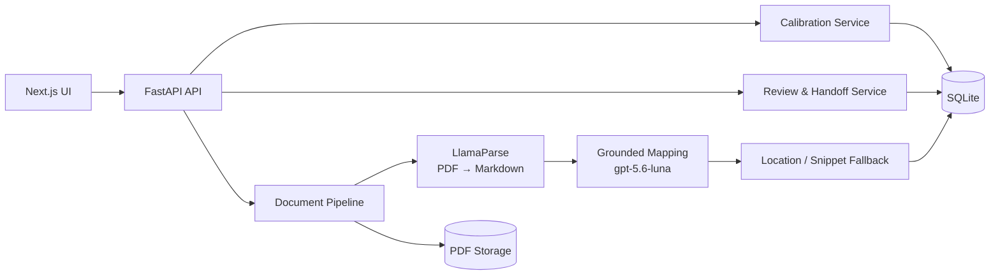
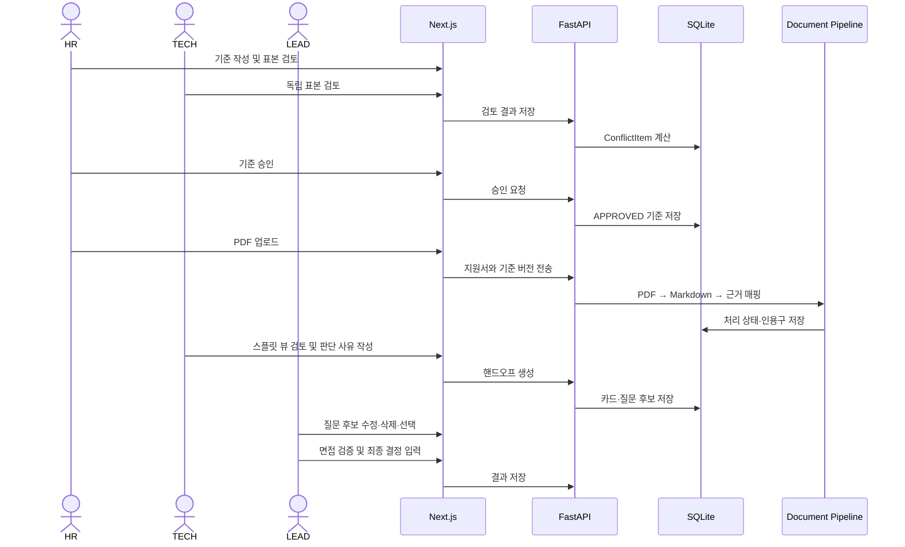

# Architecture Spine — Zero100_Builderthon

## Design Paradigm

5일 MVP에 맞춘 계층형 모듈러 모놀리스다. PDF 처리와 근거 추출은 순차 파이프라인으로 구성하고, 기준·검토·핸드오프의 핵심 규칙은 서버에서 보장한다.



## Invariants & Rules

### AD-1 — 기준 버전과 승인 게이트

- `CriteriaVersion`은 승인 후 변경하지 않고, 변경 시 새 버전을 만든다.
- 모든 근거·검토·핸드오프는 `criteria_version_id`를 참조한다.
- 미해결 교정 충돌이 있으면 기준을 승인할 수 없다.
- 승인된 기준만 공식 핸드오프와 최종 결정에 사용할 수 있다. 미승인 기준은 교정용 미리보기로만 사용한다.

### AD-2 — 원문 근거와 위치

- LLM이 반환한 인용구는 LlamaParse가 만든 정규화 Markdown의 원문 부분 문자열이어야 한다.
- 인용구에는 지원서, 기준 버전, 처리 실행, 페이지 또는 Markdown 위치를 함께 저장한다.
- PDF 좌표를 확인할 수 없으면 스니펫과 주변 문맥을 보여주는 fallback을 사용한다.
- 원문이 다시 처리되면 기존 인용구를 덮어쓰지 않고 새 결과를 만든다.

### AD-3 — 독립 검토와 충돌 보존

- HR과 직무 담당자의 검토는 별도 `ReviewLog`로 저장한다.
- 상태·근거의 불일치는 서버 로직으로 `ConflictItem`을 계산한다.
- AI가 두 의견을 임의로 합치거나 한쪽을 삭제하지 않는다.

### AD-4 — 스플릿 뷰 동기화

- 화면은 `active_citation_id`를 기준으로 현재 근거를 관리한다.
- 우측 인용구를 클릭하면 좌측 원문이 해당 페이지·위치로 이동한다.
- 좌표가 없으면 좌측에 스니펫·문맥을 표시한다.

### AD-5 — 인터뷰 질문 후보

- 질문 후보는 핸드오프에 연결된 독립 리소스로 저장한다.
- 각 후보는 기준, 우려 또는 원문 근거와 연결된다.
- 원래 질문과 현재 수정본을 구분하고, 삭제는 목록에서 숨기는 방식으로 처리한다.
- 검토자가 수정·삭제하고, 현업 리더가 선택한 질문만 최종 핸드오프에 포함한다.
- 정확한 질문 개수는 고정하지 않고 추후 결정한다.

### AD-6 — 문서 처리와 모델 설정

- 입력은 PDF로 제한한다.
- 처리 순서는 `PDF → LlamaParse → Markdown Normalizer → gpt-5.6-luna → Location Resolver`다.
- `OPENAI_API_KEY`, `OPENAI_BASE_URL`, `LLAMA_CLOUD_API_KEY`, `LLAMA_CLOUD_BASE_URL`은 서버 환경변수 또는 `.env`에서만 읽는다.
- 파싱·매핑 실패는 실패 상태로 저장하며 완료된 결과처럼 노출하지 않는다.

### AD-7 — 처리 실행 기록

- PDF, LlamaParse Markdown, 정규화 Markdown과 처리 상태를 지원서별로 보존한다.
- 처리 실행에는 사용 모델, 단계, 실행 시각, 성공·실패 상태와 오류를 기록한다.
- 재시도 시 이전 부분 결과를 완료 결과로 덮어쓰지 않는다.

### AD-8 — 사람 주도 면접·결정

- 인터뷰 질문 후보와 실제 면접 결과를 별도로 기록한다.
- 초기 서류 가설과 면접 검증 결과를 분리해 비교할 수 있어야 한다.
- 최종 결정은 사람이 직접 입력하며 자동 합격·탈락 결정은 제공하지 않는다.

### AD-9 — API와 권한 경계

- 브라우저는 FastAPI를 통해서만 데이터와 PDF에 접근한다.
- HR은 기준 교정·승인, TECH는 직무 검토, LEAD는 핸드오프·질문 선택·면접 검증·최종 결정을 담당한다.
- 다른 검토자의 로그를 수정할 수 없으며, 기준 승인·핸드오프·결정 기록은 하나의 트랜잭션으로 저장한다.
- API 키와 서버 파일 경로는 브라우저에 노출하지 않는다.

## 핵심 상태

| 대상 | 상태 |
| :--- | :--- |
| 기준 버전 | `DRAFT`, `APPROVED`, `ARCHIVED` |
| 검토 | `FULFILLED`, `PARTIALLY_FULFILLED`, `UNFULFILLED`, `UNVERIFIABLE` |
| 처리 | `RECEIVED`, `PARSING`, `MAPPING`, `COMPLETED`, `FAILED` |
| 충돌 | `OPEN`, `RESOLVED` |
| 질문 | `CANDIDATE`, `SELECTED`, `DELETED` |

## Interview Question Candidate Contract

핸드오프 카드 생성 시 질문 후보를 함께 만든다. 정확한 후보 개수는 추후 결정한다.

| 기능 | 동작 |
| :--- | :--- |
| 생성 | 승인된 기준과 검토 근거에 연결된 후보를 만든다. |
| 조회 | 후보의 질문, 이유, 연결 기준·근거, 선택 상태를 보여준다. |
| 수정 | 현재 질문을 수정하되 원래 질문은 보존한다. |
| 삭제 | 후보를 soft delete한다. |
| 선택 | 선택된 후보만 최종 핸드오프 질문으로 사용한다. |

## Core API Contracts

| 기능 | Endpoint |
| :--- | :--- |
| 기준 조회·수정 | `GET/PATCH /api/criteria/{criteria_version_id}` |
| 교정 검토 저장 | `POST /api/criteria/{criteria_version_id}/reviews` |
| 충돌 조회·해결 | `GET/POST /api/criteria/{criteria_version_id}/conflicts` |
| 기준 승인 | `POST /api/criteria/{criteria_version_id}/approve` |
| 지원서 업로드 | `POST /api/applications/upload` |
| 처리·지원서 조회 | `GET /api/applications`, `GET /api/applications/{application_id}` |
| 근거 조회 | `GET /api/applications/{application_id}/evidence` |
| 지원서 검토·충돌 | `POST /api/applications/{application_id}/reviews`, `GET /api/applications/{application_id}/conflicts` |
| 핸드오프 생성·조회 | `POST /api/handoff/generate`, `GET /api/handoff/{handoff_id}` |
| 질문 후보 | `GET/PATCH/DELETE /api/questions/{question_id}`, `POST /api/questions/{question_id}/select` |
| 면접·최종 결정 | `POST /api/handoff/{handoff_id}/verifications`, `POST /api/handoff/{handoff_id}/decision` |

공식 핸드오프는 승인된 기준, 처리 완료 지원서, 저장된 근거와 검토 로그가 있을 때만 생성한다. 모든 API는 서버에서 역할과 기준 버전을 확인한다.

## Presentation Demo Contract

발표는 승인된 기준 버전이 존재하는 검토 화면에서 시작한다.

```text
기준 버전 확인 10초 → 대표 지원서 선택 10초 → 근거 확인 25초
→ 의견 차이 확인 15초 → 핸드오프 카드 10초 → 질문 후보 조정 20초
```

화면은 다음을 보여준다.

1. 승인된 기준 버전과 처리 상태
2. PDF 원문 또는 Markdown fallback과 기준별 인용구
3. HR·TECH 의견 차이와 각자의 근거
4. 핸드오프 카드와 인터뷰 질문 후보의 수정·삭제·선택

## Stack

| 영역 | 기술 |
| :--- | :--- |
| Frontend | Next.js, React, Tailwind CSS |
| Backend | FastAPI, Pydantic |
| Document Parser | LlamaParse (`llama_cloud`) |
| LLM | OpenAI API, `gpt-5.6-luna` |
| Storage | SQLite, PDF file storage |
| Configuration | Server-side environment variables / `.env` |

## Structural Seed



## Core Entity ERD

```mermaid
erDiagram
    POSITION ||--o{ CRITERIA_VERSION : has
    CRITERIA_VERSION ||--o{ CRITERIA_ITEM : contains
    CRITERIA_VERSION ||--o{ CALIBRATION_SAMPLE : uses
    POSITION ||--o{ APPLICATION : receives
    APPLICATION ||--o{ PROCESSING_RUN : has
    CRITERIA_VERSION ||--o{ PROCESSING_RUN : evaluates
    APPLICATION ||--o{ EVIDENCE_MAPPING : has
    CRITERIA_ITEM ||--o{ EVIDENCE_MAPPING : maps
    EVIDENCE_MAPPING ||--o{ EVIDENCE_CITATION : cites
    APPLICATION ||--o{ REVIEW_LOG : has
    CRITERIA_ITEM ||--o{ REVIEW_LOG : evaluates
    REVIEW_LOG ||--o{ CONFLICT_ITEM : contributes
    APPLICATION ||--o{ HANDOFF_CARD : receives
    HANDOFF_CARD ||--o{ INTERVIEW_QUESTION_CANDIDATE : proposes
    INTERVIEW_QUESTION_CANDIDATE ||--o{ INTERVIEW_VERIFICATION : verifies
    HANDOFF_CARD ||--o{ INTERVIEW_VERIFICATION : records
    HANDOFF_CARD ||--o{ DECISION_RECORD : concludes

    POSITION { string id PK; string title }
    CRITERIA_VERSION { string id PK; string position_id FK; string status; datetime created_at }
    CRITERIA_ITEM { string id PK; string criteria_version_id FK; string criterion_text; string requirement_type }
    CALIBRATION_SAMPLE { string id PK; string criteria_version_id FK; string application_id FK }
    APPLICATION { string id PK; string position_id FK; string original_pdf_path; string markdown_path; string processing_status }
    PROCESSING_RUN { string id PK; string application_id FK; string criteria_version_id FK; string status; string model_identifier }
    EVIDENCE_MAPPING { string id PK; string application_id FK; string criteria_item_id FK; string outcome }
    EVIDENCE_CITATION { string id PK; string evidence_mapping_id FK; string snippet_text; int page_number; string location }
    REVIEW_LOG { string id PK; string application_id FK; string criteria_item_id FK; string reviewer_role; string status; string reason_text }
    CONFLICT_ITEM { string id PK; string application_id FK; string criteria_item_id FK; string status; string reason }
    HANDOFF_CARD { string id PK; string application_id FK; string criteria_version_id FK; string status }
    INTERVIEW_QUESTION_CANDIDATE { string id PK; string handoff_card_id FK; string criteria_item_id FK; string original_text; string question_text; string selection_status }
    INTERVIEW_VERIFICATION { string id PK; string handoff_card_id FK; string question_id FK; string initial_hypothesis; string interview_finding }
    DECISION_RECORD { string id PK; string handoff_card_id FK; string decision_value; string rationale_text }
```

## Source Tree

```text
BLDT_BMAD/
├── backend/app/
│   ├── api/          # criteria, applications, handoff, questions
│   ├── models/       # database models
│   ├── services/     # calibration, review, handoff, decision
│   └── pipeline/     # LlamaParse, Markdown normalization, mapping
├── frontend/src/
│   ├── app/          # calibration, review, handoff pages
│   └── components/   # split view, PDF viewer, criteria panel, card
└── docs/             # presentation artifacts
```

## Capability → Architecture Map

| Capability | Main component |
| :--- | :--- |
| F1. 기준 교정 게이트 | `services/calibration.py`, `app/calibration/` |
| F2. 근거 매핑·스플릿 뷰 | `pipeline/`, `components/SplitView/` |
| F3. 공동 판단·핸드오프 | `services/review.py`, `services/handoff.py`, `app/handoff/` |

## Deferred

1. **D-01 — 정확한 인터뷰 질문 후보 개수**: 정확한 개수는 추후 결정한다.
2. **D-02 — 발표용 데이터세트**: PDF 입력은 고정하되, 발표용 파일 수와 구성은 추후 결정한다.
3. **D-03 — 베이스라인 비교(PB-02)**: 현재 MVP 범위에서 다루지 않는다.
4. **D-04 — 문제 정의 카드의 최종 숫자·출처**: 제출 전에 확정한다.
5. **D-05 — 레포·배포 링크**: 제출 전에 확정한다.
6. **D-06 — `2분 이내` 보조 지표**: 데모 검증 시 결정한다.
7. **D-07 — PDF 좌표 하이라이트 지원 범위**: 좌표를 찾지 못하면 스니펫·문맥 fallback을 사용한다.

MVP 이후 항목인 멀티 테넌트, SSO, ATS 연동, 대규모 작업 큐는 이번 구현 범위에 포함하지 않는다.
