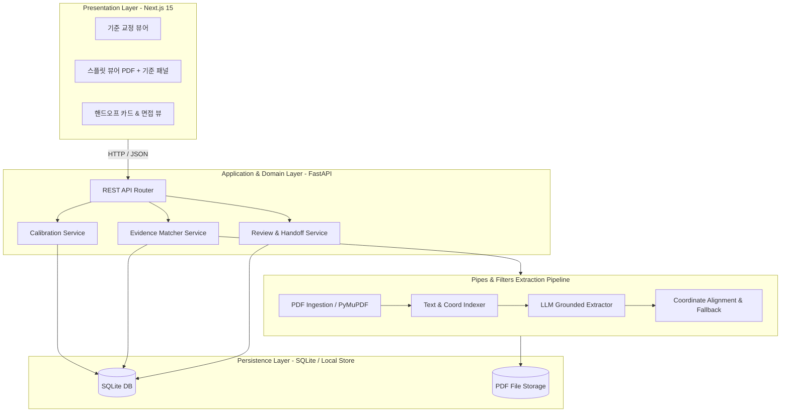
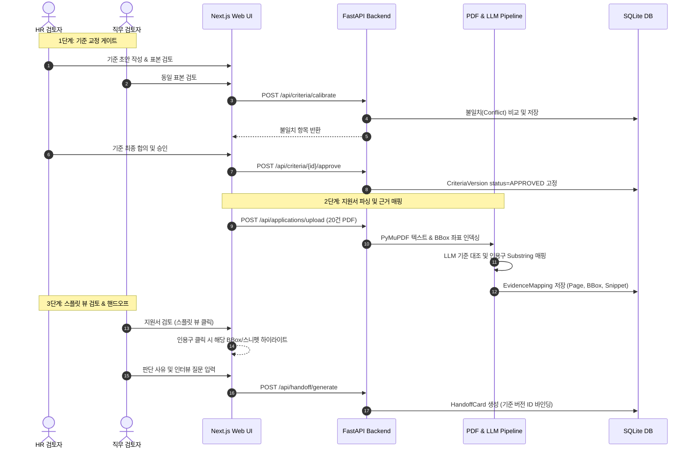
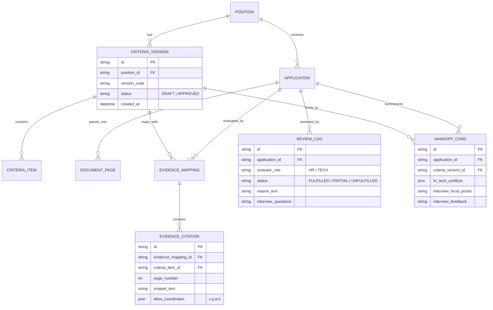

# Architecture Spine — Zero100_Builderthon (근거 기반 채용 핸드오프 시스템)

## Design Paradigm

본 시스템은 **계층형 모듈러 모놀리스(Layered Modular Monolith)**를 기본 골격으로 하고, 비정형 이력서 PDF 파싱 및 인용구 추출 영역에는 **파이프-필터(Pipes-and-Filters)** 파이프라인을 적용한다.



---

## Invariants & Rules

### AD-1 — 기준 버전 불변성 및 공식 핸드오프 게이팅 [ADOPTED]
- **Binds:** FR-001, FR-004, FR-005, FR-011
- **Prevents:** 미승인/불완전 기준 버전으로 생성된 평가 결과가 공식 면접 핸드오프 카드나 최종 결정 기록으로 유출되는 오염 방지.
- **Rule:** 
  1. 모든 `EvidenceMapping`, `ReviewLog`, `HandoffCard`는 반드시 불변 식별자인 `criteria_version_id`를 외래 키로 참조해야 한다.
  2. `CriteriaVersion.status != 'APPROVED'`인 경우, `preview_mode = true` 워터마크가 강제되며 공식 `HandoffCard` 생성 API 호출은 `HTTP 403 / 422`로 차단된다.

### AD-2 — 엄격한 원문 역추적 및 좌표 Fallback 보증 [ADOPTED]
- **Binds:** FR-006, FR-007, FR-008, FR-010
- **Prevents:** LLM의 환각 요약문이 근거로 제시되거나, PDF 내 위치를 찾지 못해 검토자가 원문 대조를 포기하는 상황 방지.
- **Rule:** 
  1. LLM 출력 근거는 원문 텍스트의 부분 문자열(Exact Substring)과 100% 일치해야 하며, 서버는 파싱된 텍스트 인덱스에서 `exact match`를 검증한 후 저장한다.
  2. 매핑 결과는 `{ page_number, snippet, bounding_box: { x, y, w, h } }` 구조를 가진다. PDF 렌더링 엔진에서 좌표 파싱이 불가능하거나 실패할 경우, 클라이언트는 즉시 `{ snippet, page_number, context_box }` 텍스트 블록으로 자동 Fallback 렌더링한다.

### AD-3 — 검토자 독립성 및 결정론적 충돌 계산 [ADOPTED]
- **Binds:** FR-002, FR-003, FR-013, FR-015
- **Prevents:** HR 검토자와 직무 담당자의 의견 차이가 AI에 의해 임의로 요약·중재되어 사라지거나, 상호 간섭으로 독립 평가가 왜곡되는 현상 방지.
- **Rule:** 
  1. 검토자별 입력(`ReviewerLog`: reviewer_role, status, reason, cited_snippet_ids)은 독립 레코드로 저장된다.
  2. 상태 불일치(`충족` vs `미충족` 등) 및 근거 불일치는 AI가 아닌 **서버 비즈니스 로직에 의해 결정론적(Deterministic Diff)**으로 산출되어 `ConflictItem`으로 보존된다.

### AD-4 — 스플릿 뷰 양방향 인터랙션 동기화 계약 [ADOPTED]
- **Binds:** FR-009, FR-010
- **Prevents:** 우측 기준 패널의 인용구 클릭 시 좌측 PDF 뷰어의 스크롤 및 하이라이트 동기화가 어긋나거나 지연되는 현상 방지.
- **Rule:** 
  1. 클라이언트 상태는 `active_citation_id`를 단일 진실 공급원(Single Source of Truth)으로 관리한다.
  2. 우측 기준 카드의 인용구 태그 클릭 시, 좌측 PDF 뷰어로 `{ page, bbox, snippet }` 포커스 이벤트가 발행되어 해당 페이지로 즉시 점프 및 하이라이트 박스가 활성화된다.

---

## Consistency Conventions

| Concern | Convention |
| :--- | :--- |
| **ID Naming** | `pos_<uuid>`, `crit_ver_<timestamp>`, `app_<uuid>`, `cite_<uuid>`, `handoff_<uuid>` |
| **Status Enums** | 기준 상태: `DRAFT`, `APPROVED`, `ARCHIVED`<br>검토 상태: `FULFILLED` (충족), `PARTIALLY_FULFILLED` (부분 충족), `UNFULFILLED` (미충족), `UNVERIFIABLE` (확인 불가) |
| **Data Envelopes** | REST 응답은 `{ "success": true, "data": { ... }, "error": null }` 표준 엔벨로프 준수 |
| **Error Handling** | 표준 RFC 7807 호환 에러 응답 (`{ "code": "CRITERIA_NOT_APPROVED", "message": "..." }`) |
| **Date & Time** | ISO 8601 UTC (`2026-08-26T10:25:00Z`) |

---

## Stack

| Component | Technology | Version | Role |
| :--- | :--- | :--- | :--- |
| **Frontend Framework** | Next.js (App Router) | 15.x | 클라이언트 UI, 라우팅, 서버 컴포넌트 |
| **Frontend UI/Styling** | React 19, Tailwind CSS, shadcn/ui | Latest | 반응형 대시보드 및 스플릿 뷰 레이아웃 |
| **PDF Rendering** | `@react-pdf-viewer/core` / PDF.js | 3.11.x | 웹 브라우저 내 PDF 뷰어 및 바운딩 박스 하이라이트 |
| **Backend API** | FastAPI | 0.115.x | REST API 라우팅, 비동기 파이프라인 제어 |
| **Data Validation** | Pydantic | v2.10.x | 요청/응답 스키마 및 LLM Structured Outputs 검증 |
| **PDF Engine** | PyMuPDF (`fitz`) | 1.25.x | 고속 텍스트 추출, 페이지/라인별 Bounding Box 좌표 생성 |
| **LLM Provider** | OpenAI API (`gpt-4o-mini`) | 2026 API | 구조화된 JSON 모드를 통한 근거 인용구 및 상태 추출 |
| **Database** | SQLite + SQLAlchemy 2.0 (or SQLModel) | 3.45+ | 5일 해커톤 데모용 무설치 로컬 관계형 DB |

---

## Structural Seed

### 1. 시스템 계층 및 데이터 흐름 다이어그램



### 2. Core Entity ERD



### 3. 디렉토리 구조 (Source Tree)

```text
BLDT_BMAD/
├── backend/                  # FastAPI Backend
│   ├── app/
│   │   ├── api/              # REST Endpoints (criteria, applications, handoff)
│   │   ├── core/             # Config, DB connection, Base Models
│   │   ├── models/           # SQLAlchemy Models (Schema)
│   │   ├── services/         # Business Logic (Calibration, LLM Extractor, Handoff)
│   │   ├── pipeline/         # PDF Parsing (PyMuPDF), Coordinate Aligners
│   │   └── mock_data/        # 20 Synthetic Candidate Resumes (PDF & JSON)
│   ├── tests/
│   └── requirements.txt
├── frontend/                 # Next.js 15 Frontend
│   ├── src/
│   │   ├── app/              # App Router Pages (/calibration, /review, /handoff)
│   │   ├── components/       # SplitView, PDFViewer, CriteriaPanel, HandoffCard
│   │   ├── hooks/            # usePDFHighlight, useSyncCitation
│   │   ├── lib/              # API Client, Coordinate utils
│   │   └── types/            # TypeScript Schema Definitions
│   ├── public/
│   └── package.json
└── docs/                     # Documentation & Presentation Artifacts
```

---

## Capability → Architecture Map

| Capability (PRD) | Implementation Component | Governance & AD |
| :--- | :--- | :--- |
| **F1. 기준 교정 게이트** (FR-001~005) | `backend/app/services/calibration.py`<br>`frontend/src/app/calibration/` | **AD-1**, **AD-3** |
| **F2. 근거 매핑 자격 대조기** (FR-006~012) | `backend/app/pipeline/pdf_extractor.py`<br>`frontend/src/components/SplitView/` | **AD-2**, **AD-4** |
| **F3. 공동 판단 & 핸드오프 카드** (FR-013~018) | `backend/app/services/handoff.py`<br>`frontend/src/app/handoff/` | **AD-1**, **AD-3** |

---

## Deferred

다음 항목들은 5일 해커톤 데모의 범위를 벗어나며, 후속 상용화 단계로 명시적 연기(Deferred)한다:
1. **멀티 테넌트 권한 및 SSO**: 해커톤에서는 단일 워크스페이스 내 간단한 역할 전환(HR / Tech Reviewer 토글)으로 대체.
2. **외부 ATS 연동(Greenhouse, Lever 등)**: 파일 직접 업로드 및 로컬 mock 데이터셋으로 검증.
3. **대규모 비동기 작업 큐(Celery/Redis)**: 20건 데모 볼륨은 FastAPI BackgroundTasks 또는 실시간 스트리밍 처리로 충분하므로 무거운 메시지 브로커는 제외.
