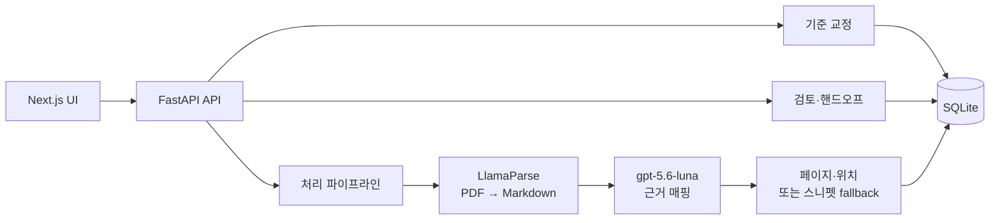

# [발표용] 근거 기반 채용 핸드오프 시스템 설계 요약

> **프로젝트명:** Zero100_Builderthon (Code.presso)  
> **목적:** 5분 발표와 90초 클릭 데모를 위한 시스템 요약

## 1. 30초 피칭 요약

* **문제:** 대량 이력서 검토에서 HR과 현업의 기준이 어긋나고, 판단 근거가 남지 않는다.
* **해결책:** AI가 합격·탈락을 결정하지 않고, 승인된 기준에 따라 PDF 원문과 LlamaParse Markdown의 근거를 연결한다.
* **차별점:** 기준 합의, 원문 근거 확인, 검토자 의견 차이 보존, 인터뷰 질문 후보 인계.

## 2. 시스템 구조



## 3. 담당자가 믿게 만드는 장치

### 기준 교정 게이트

HR과 직무 담당자가 표본을 독립적으로 검토하고, 불일치 항목을 확인한다. 충돌이 해결되고 기준이 `APPROVED`되기 전에는 공식 핸드오프를 만들 수 없다.

### 원문 근거 매핑

PDF를 LlamaParse로 Markdown으로 변환한 뒤, 기준별 원문 인용구를 연결한다. 인용구를 클릭하면 원문 위치로 이동하고, 위치를 찾지 못하면 스니펫과 주변 문맥을 표시한다.

### 의견 보존형 핸드오프

HR과 TECH의 판단·사유를 합치지 않고 분리해서 보여준다. 핸드오프에는 인터뷰 질문 후보가 포함되며, 현업 리더가 수정·삭제·선택한다.

## 4. 베이스라인 비교

| 비교 항목 | 범용 LLM에 이력서 입력 | 본 시스템 |
| :--- | :--- | :--- |
| 기준 | 대화마다 달라질 수 있음 | 승인된 기준 버전 사용 |
| 근거 | 요약 중심 | 원문 인용구와 위치 연결 |
| 이견 | 단일 답으로 합쳐질 수 있음 | HR·TECH 의견을 분리 보존 |
| 결정 | 자동 결론으로 이어질 수 있음 | 사람의 검토·결정만 기록 |

## 5. 90초 클릭 데모

```text
기준 버전 확인 10초 → 대표 지원서 선택 10초 → 근거 확인 25초
→ 의견 차이 확인 15초 → 핸드오프 카드 10초 → 질문 후보 조정 20초
```

1. 승인된 기준 버전 확인
2. 처리 상태 목록에서 대표 지원서 선택
3. 인용구 클릭 후 원문 위치 또는 Markdown 문맥 확인
4. 두 검토자의 의견 차이와 근거 확인
5. 핸드오프 카드 열기
6. 인터뷰 질문 후보 수정·삭제·선택

정확한 발표용 데이터세트, 질문 후보 개수, 베이스라인 비교 실행, 레포·배포 링크는 PRD의 deferred item으로 남긴다.
