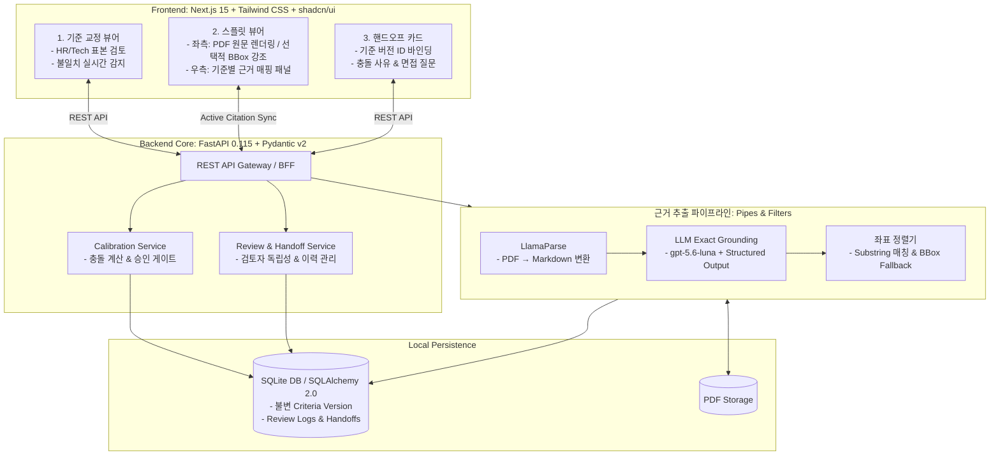
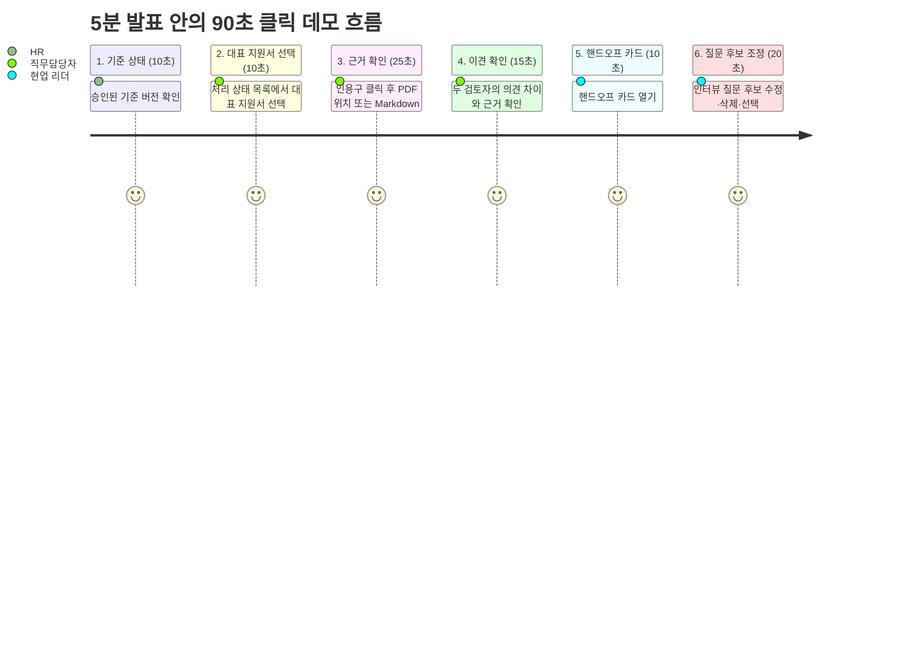

# [발표용] 근거 기반 채용 핸드오프 시스템 설계 요약 & 시스템 구조

> **프로젝트명:** Zero100_Builderthon (Code.presso)  
> **문서 목적:** 해커톤 심사위원 및 5분 발표/데모를 위한 1장 아키텍처 요약 (DEL-002 연계)

---

## 1. 30초 피칭 요약 (Executive Summary)

* **문제:** 대량 이력서 검토 시 HR과 현업 간 기준 불일치로 재검토가 빈번하며, 기존 AI 요약은 환각(Hallucination)과 근거 부재로 현업의 신뢰를 얻지 못함.
* **해결책:** AI가 합/불을 결정하지 않고, **사전 승인된 기준에 맞춰 PDF 원문과 LlamaParse 변환 Markdown의 인용구·위치를 1:1 매핑**하여 좌우 분할 화면으로 즉시 대조한다. 페이지·BBox가 없으면 스니펫과 주변 문맥으로 대체한다.
* **차별점:** 
  1. **사전 기준 합의(Calibration Gate)** 없이는 공식 핸드오프 불가
  2. **100% 원문 역추적 가능한 근거 매핑** 및 좌표 Fallback
  3. HR-현업 간 **의견 불일치를 삭제하지 않고 면접 검증 질문으로 인계(Handoff Card)**

---

## 2. 전체 시스템 구조도 (System Architecture Diagram)

---

## 3. 핵심 3대 기술 메커니즘 (Core Engineering Highlights)

### ① 기준 교정 게이트 (Criteria Calibration Gate)
* **목적:** 평가 시작 전 HR과 직무 담당자의 평가 기준 해석을 동기화.
* **동작:** 두 담당자가 표본 지원서를 각각 채점하고, 상태(`충족`/`미충족`) 또는 근거 위치가 다를 경우 시스템이 `ConflictItem`으로 표시.
* **가드레일:** 기준 버전이 최종 `APPROVED`되기 전까지는 모든 검토가 `[미리보기]` 모드로 제한되며, 공식 `HandoffCard` 발급이 원천 차단됨.

### ② 원문 근거 매핑 & 스플릿 뷰 동기화 (Evidence Mapping & Split-View Sync)
* **목적:** AI 생성 텍스트의 환각을 배제하고 검토 속도를 극대화.
* **동작:** 
  1. `LlamaParse`가 PDF를 Markdown으로 변환하고 페이지·헤딩·문단 정보를 가능한 범위에서 보존한다.
  2. `gpt-5.6-luna`가 지원서에서 직무 기준을 증명하는 **원문 텍스트(Exact Substring)**를 추출한다.
  3. 사용자가 우측 기준 패널의 인용구를 클릭하면 좌측 PDF 뷰어가 해당 페이지로 이동하고, 가능한 경우 BBox를 하이라이트한다.
  4. *(위치 파싱 실패 시)* 즉시 `스니펫 + 페이지 또는 Markdown block + 문맥 박스`로 자동 Fallback하여 UI 끊김을 방지한다.

### ③ 충돌 보존형 핸드오프 카드 (Conflict-Preserving Handoff Card)
* **목적:** 1차 서류 검토에서의 의문과 이견을 면접관(현업 리더)에게 투명하게 인계.
* **동작:** HR의 의견과 직무 담당자의 의견을 AI가 임의로 평균내지 않고, **두 검토자의 불일치 사유와 근거**를 분리 표기하여 면접관이 실제 면접에서 검증할 핵심 질문 리스트를 자동 제공.

---

## 4. 베이스라인 비교 (vs 범용 LLM 단순 질의)

| 비교 항목 | 일반 범용 LLM (ChatGPT 등에 이력서 붙여넣기) | 본 시스템 (근거 기반 핸드오프 시스템) |
| :--- | :--- | :--- |
| **기준 통제** | 프롬프트마다 기준이 흔들리며 버전 관리가 안 됨 | **사전 승인된 CriteriaVersion ID 불변 바인딩** |
| **근거 제시** | 요약문 생성 위주 (환각 발생 시 검증 불가) | **원문 100% 일치 인용구 + PDF/Markdown 위치 + 선택적 하이라이트** |
| **이견 처리** | AI가 양쪽 의견을 임의로 뭉개거나 단일 결론 도출 | **HR ↔ 현업 간 판단 불일치를 명시적 보존** |
| **사후 추적** | 시간이 지나면 왜 합격/탈락시켰는지 추적 불가 | **기준 버전-원문 근거-판단 로그가 1:1 감사 가능** |
| **자동화 위험** | 임의의 점수/순위로 차별 및 오류 가능성 | **자동 합/불 결정 차단, 인간 판단 보조 가드레일** |

---

## 5. 5분 발표 안의 90초 클릭 데모 시나리오 흐름 (Demo Storyboard)

